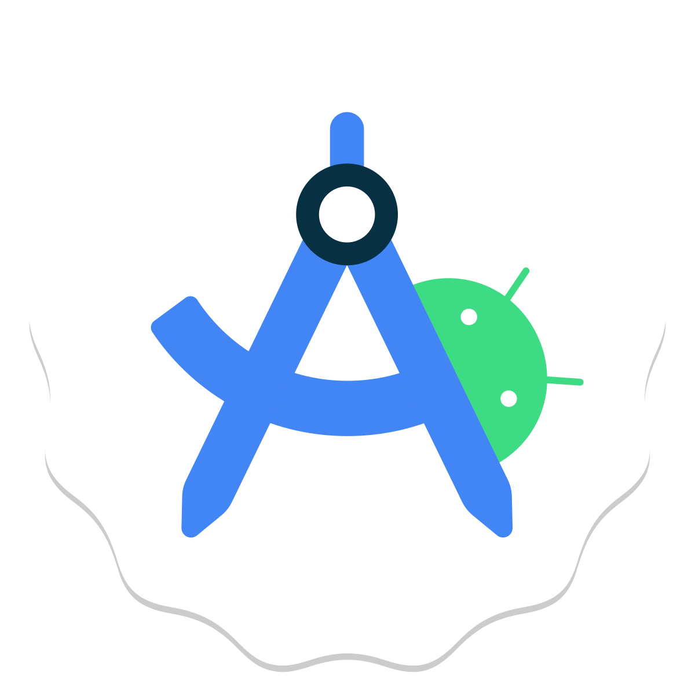

<h1 align="center">Hi, I'm Elena </h1>
<h3 align="center">QA Engeneer</h3>

## ⚙️ Contact me

    

## ⚙️ Tech Stack

    
    
    
    
    
    
    
    
    
    
    
    
    
    
    
    

## ⚙️ My graduation projects for QA.GURU School of Test Automation Engineers in Java

### [Тестирование UI web-сайта банка Уралсиб](https://github.com/esilaeva/qa_guru_final_project_ui)  

### [Тестирования API агрегатора новостей Feedbin](https://github.com/esilaeva/qa_guru_final_project_api)  

### [Тестирование мобильного приложения Wire.com](https://github.com/esilaeva/qa_guru_final_project_mobile)  

## ⚙️ GitHub Analytics
  

